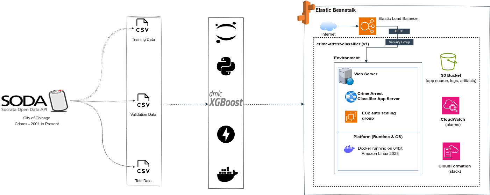

# Chicago Crime Arrest Prediction System

A comprehensive machine learning system for predicting arrest likelihood in Chicago crime incidents, built with modern software engineering practices and deployed as a scalable web service.

## Project Overview

This project implements an end-to-end machine learning pipeline that predicts the probability of arrest for reported crime incidents in Chicago. The system transforms raw crime data into actionable insights for law enforcement resource allocation and operational efficiency.

**Business Context**: [Detailed Business Problem & Requirements](notes/00_business_problem_and_requirements.md)

## Data Pipeline and Development Journey



This project was built incrementally through a structured approach, with each phase building upon previous work to create a robust, production-ready system.

**Technology Stack**:

- **Backend**: 
- **ML Framework**:  with scikit-learn pipeline integration
- **Frontend**:    for lightweight, responsive interface
- **Containerization**: 
- **Cloud Platform**:  for managed deployment

**Complete Documentation**: Explore the [notes/](notes/) directory for detailed technical documentation covering each phase of development.

### Phase 1: Data Foundation

- **[Data Pipeline Setup](notes/01_predictive_policing_data_pipeline.md)**: Established robust data ingestion from Chicago Open Data Portal using SODA API with automated retrieval and processing capabilities
- **[Exploratory Analysis](notes/02_exploratory_data_analysis.md)**: Comprehensive data exploration, quality assessment, and feature selection strategy to understand crime patterns and arrest likelihood factors

### Phase 2: Machine Learning Core

- **[Model Development](notes/03_machine_learning_model_training.md)**: XGBoost classifier implementation with strategic feature engineering and hyperparameter optimization for optimal performance. The model uses class weight balancing (`scale_pos_weight=4.17`) to handle the imbalanced dataset where arrests represent only 12% of incidents.
- **[Production Architecture](notes/04_modular_architecture_and_production_deployment.md)**: Modular code structure with separation of concerns, configuration management, and scalable design patterns

### Phase 3: Quality Assurance (Optional)

- **[Testing Framework](notes/05_testing_framework_and_quality_assurance.md)**: Comprehensive test suite covering unit tests, integration tests, and model validation to ensure system reliability

### Phase 4: Web Services

- **[API Development](notes/06_web_service_deployment_of_model.md)**: FastAPI-based prediction service with RESTful JSON endpoints for seamless integration
- **[Web Interface](notes/07_web_interface_and_api_integration.md)**: User-friendly web application supporting file upload and batch predictions with intuitive interface design

### Phase 5: Deployment & Operations

- **[Containerization](notes/08_containerization_and_docker_deployment.md)**: Docker-based deployment with multi-stage builds, optimization, and consistent environment management
- **[Cloud Deployment](notes/09_aws_elastic_beanstalk_deployment.md)**: AWS Elastic Beanstalk deployment with auto-scaling, load balancing, and managed infrastructure. Elastic Beanstalk provides the optimal balance of simplicity and scalability for rapid iteration and prototyping, offering managed infrastructure with automatic scaling while we evaluate the system's performance before transitioning to a more cost-effective serverless architecture.

The data processing pipeline transforms raw Chicago crime data through several stages:

1. **Data Extraction**: Automated retrieval from Chicago Open Data Portal
2. **Feature Engineering**: Temporal, categorical, and geographic feature creation
3. **Model Training**: XGBoost classifier with hyperparameter optimization
4. **Evaluation**: Comprehensive performance metrics and validation
5. **Deployment**: Containerized web service with prediction API

## Model Performance

The trained XGBoost model with class weight balancing demonstrates strong predictive performance across multiple metrics:

- **Accuracy**: 89% (correctly classifies 89% of all crime incidents)
- **AUC-ROC**: 0.87 (excellent discrimination capability between arrest and non-arrest cases)
- **Precision**: 56% (when model predicts arrest, it's correct 56% of the time)
- **Recall**: 55% (captures 55% of actual arrest cases)
- **F1-Score**: 0.56 (balanced precision-recall performance)

The model uses balanced class weights (scale_pos_weight=4.17) to address the dataset imbalance where arrests represent only 12% of incidents. For detailed model architecture and training methodology, see [Model Development Notes](notes/03_machine_learning_model_training.md).

## Serverless Implementation

This project includes a **serverless branch** that demonstrates deploying the same ML model using AWS serverless resources (Lambda, API Gateway, S3). This alternative deployment approach offers cost optimization and automatic scaling for production workloads. Check out the `serverless` branch to explore this implementation.

## Quick Start

### Prerequisites

Install the following if you don't have them:

- [Python 3.12+](https://www.python.org/downloads/)
- [UV](https://docs.astral.sh/uv/getting-started/installation/) (package manager)
- [Docker](https://docs.docker.com/desktop) (for containerization)
- [AWS CLI](https://docs.aws.amazon.com/cli/latest/userguide/getting-started-install.html) (for cloud deployment)

### Installation & Setup

```sh
# Clone and navigate to project
git clone <repository-url>
cd chicago-crimes

# Install dependencies using UV
uv sync

# Activate virtual environment
source .venv/bin/activate  # Linux/Mac
# or
.venv\Scripts\activate     # Windows

# Install pre-commit hooks for code quality
pre-commit install

# Set up environment variables
cp .env.example .env
# Edit .env with your configuration
```

### Running the Application

**Local Development:**

```sh
# Start the web interface
python run_api.py

# Or use uvicorn directly
uvicorn src.predict-api:app --host 0.0.0.0 --port 8000 --reload
```

**Docker Deployment:**

```sh
# Build and run container
docker build -t chicago-crimes .

docker run -p 8000:8000 chicago-crimes
```

**AWS Elastic Beanstalk:**

```sh
# Initialize and deploy
eb init \
    -p docker crime-arrest-classifier \
    -r <region> \
    --profile <profile>

eb create crime-arrest-classifier-env
```

**Resource Cleanup:**
When finished with AWS resources, follow the [cleanup instructions](notes/10_aws_elastic_beanstalk_cleanup.md) to avoid incurring charges.

## Core Components

The system follows a modular architecture designed for maintainability, testability, and scalability:

```txt
src/
├── chicago_crimes/           # Core ML package
│   ├── config.py           # Configuration management
│   ├── data_loader.py      # Data ingestion and processing
│   ├── feature_engineer.py # Feature transformation pipeline
│   ├── model_trainer.py    # Training orchestration
│   └── model_evaluator.py  # Performance assessment
├── web/                    # Web interface components
│   ├── templates/          # HTML templates
│   └── static/            # CSS/JS assets
└── predict-api.py         # FastAPI application
```

## Data Sources & Compliance

The system utilizes the **Chicago Crimes - 2001 to Present** dataset from the City of Chicago Open Data Portal. All data usage complies with the city's open data terms, with appropriate disclaimers regarding data accuracy, timeliness, and privacy protections. The system implements block-level geographic aggregation to protect individual privacy while maintaining analytical utility.

## Configuration Management

The system uses environment-based configuration for flexible deployment across different environments:

```python
# Configuration through environment variables
DATABASE_URL=sqlite:///chicago_crimes.db
MODEL_PATH=models/xgb_model.pkl
API_HOST=0.0.0.0
API_PORT=8000
```

Configuration is managed through the `config.py` module, providing centralized settings management with environment-specific overrides.

## Code Quality & Development Practices

The project follows standard software development practices with automated quality assurance:

### Pre-commit Hooks

Pre-commit is used to ensure code quality and consistency before commits. It automatically runs:

- **Trailing whitespace removal**: Cleans up unnecessary whitespace
- **End-of-file fixer**: Ensures files end with newlines
- **YAML/TOML/JSON validation**: Validates configuration file syntax
- **Large file detection**: Prevents accidental commits of large files
- **Merge conflict detection**: Catches unresolved merge conflicts
- **Ruff**: Modern Python linter and formatter for code quality
- **Bandit**: Security vulnerability scanner
- **Hadolint**: Dockerfile linting for container best practices
- **Pylint**: Additional Python code analysis

### Contributing to the Project

This is an open-source project welcoming contributions. To maintain code quality:

1. **Fork and Clone**: Fork the repository and clone your fork
2. **Install Pre-commit**: Run `pre-commit install` after setup
3. **Make Changes**: Develop your features or fixes
4. **Quality Checks**: Pre-commit hooks will automatically run on commit
5. **Submit PR**: Create a pull request with your changes

Pre-commit hooks ensure all contributions meet the project's quality standards automatically, making collaboration smooth and maintaining consistent code quality across all contributors.

## Future Enhancements

Planned improvements include:

- **MLOps Implementation**: Automated model retraining pipelines, experiment tracking, and model versioning
- **Serverless Migration**: Transition from Elastic Beanstalk to AWS Lambda for cost optimization and scalability
- **Real-time Data Integration**: Live data feeds from Chicago Open Data Portal
- **Advanced Analytics**: SHAP-based model interpretability and bias detection
- **Mobile Interface**: Responsive design optimization for mobile devices
- **API Authentication**: JWT-based authentication for production deployments

## Disclaimer

This project is developed for educational and research purposes. The predictive model should not be used as the sole basis for law enforcement decisions. All predictions should be validated through proper investigative procedures and human judgment.

The documentation of this project, including this `README.md`, was generated with assistance from **Amazon Q Developer** to ensure comprehensive coverage and consistent formatting while maintaining technical accuracy.
